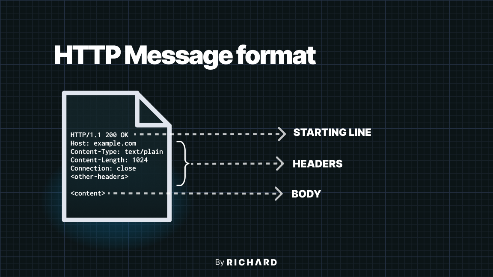
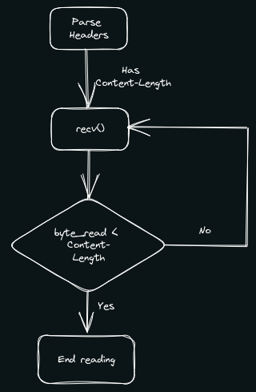

HTTP, the foundation of the World Wide Web, allows us to transfer data from one computer to another in a reliable way. But how does one know when the data transfer is complete? Can one send a sufficiently large object over an HTTP message? And if not, how can one break it down?

{/* Except */}

# Why bother?

HTTP, stands for **Hyper Text Transfer Protocol**, is a protocol built on top of [TCP](https://en.wikipedia.org/wiki/Transmission_Control_Protocol). TCP, in a nutshell, is a stream of bytes. For example, when a server wants send a message `"Hello, World"` to a client, TCP will send the message as a stream of bytes, like so:

```txt showWindowBar="false" showLineNumber="false"
server ---> 48 65 6c 6c 6f 2c 20 57 6f 72 6c 64 ---> client
```

The client will then receive the message as a stream of bytes, and it will decode the bytes into a string, `"Hello, World"`. But now, the client is asking itself: _"Is that it?"_

## Complete message?

There are many reasons to consider whether a received message is complete or not.

Old servers might have a fixed-sized buffer to send data. Many HTTP servers written in C use a stack-allocated array of some fixed size as a buffer to send data.

Modern servers might allow the buffer to store the whole data. But due to the nature of TCP, the server can only try its best to send as many bytes as possible[^1]. The short answer is that TCP is a **stream-oriented** connection, which means the message is not guaranteed to be received as a whole. It might be received with the first line, 1KB of the content, or the whole message. The only guarantee is that the bytes will be received in the same order as they were sent.

## Special characters?

You might be asking.: _"Can we just simply add newlines '\n' to the end of the message and stop reading when first encountering it?"_

Well, what if the received message is just the first line of the whole message that the server wants to send? What if the server wants to send a message that contains newlines?

_"Well then, we might use '\r\n' for the end of message while '\n' is for the newline characters"_.

That might be a good idea. But Windows uses `\r\n` as the official newline character, and certainly we don't want to discriminate Windows users, do we? Even that's something you want to do, which I highly discourage, HTTP messages use `\r\n` as the end of line character:

```http showWindowBar="false"
HTTP/1.1 200 OK\r\n
Header-1: value-1\r\n
Header-2: value-2\r\n
<more-headers>
\r\n
<content>
```

In fact, this is the standard for all Internet protocols[^2], not just for the HTTP protocol.

## Maybe we can inform the client?

Luckily, HTTP provides a schema of messages so that client knows how to interpret the message.

<br />



The example above is a HTTP response message:

1. The first line is the starting line, which contains the HTTP version, the status code, and the status message.
2. The following lines are the headers, which contains the metadata of the message. To mark the end of the headers, follow a blank line.
3. The rest of the message is the content.

Take a look at the `Content-Length` header. It tells the client how many bytes the content is. So, the client can read the content until it reaches the number of bytes specified in the `Content-Length` header.

# Content-Length Header

The purpose of the header `Content-Length` is to inform the client (mostly the user browsers) how many bytes the content contains exactly. Since TCP, as mentioned above, might send the message in multiple packets, the client must know when to stop reading the content and move on to other tasks.



## Implementation

To construct a response message with the `Content-Length` header, the server must know the size of the content beforehand. For static files such as HTML pages, the server can easily compute the value of the `Content-Length` header. Most programming languages provide a way to get the size of a file.

<CodeSwitcher>

```c title="server.c" tab="1"
int fd = open("index.html", O_RDONLY);      // Open static files
struct stat st;                             // File metadata
fstat(fd, &st);

// Response message template
char *response = "HTTP/1.1 200 OK\r\n"
                 "Content-Length: %ld\r\n"  // Content-Length header
                 "\r\n"
                 "%s";

char *content = mmap(NULL, st.st_size,      // Map file to memory
                     PROT_READ, MAP_PRIVATE,
                     fd, 0);


// Construct response message
char *message = malloc(strlen(response) + st.st_size);
sprintf(message, response, st.st_size, content);

// Send response message to client
ssize_t sent = 0;<span class="mtk3 mtki"
while (sent < strlen(message)) {
    ssize_t n = send(client_fd, message + sent, strlen(message) - sent, 0)
    if (n == -1) {
        perror("send");
        exit(1);
    }
    sent += n;
}

// Free resources
unmap(content, st.st_size);
free(message);
close(fd);
```

```py title="server.py" tab="1"

f = open("index.html", "rb")                # Open static files
content = f.read()                          # Read file content

# Response message template
response = "HTTP/1.1 200 OK\r\n"      \
           "Content-Length: %d\r\n"   \
           "\r\n"                     \
           "%s"

# Construct response message
message = response % (len(content), content)
```

</CodeSwitcher>

[^1]: [Beej's Guide to Network Programming 5.7. send() and recv()](https://beej.us/guide/bgnet/html/#sendrecv)
[^2]: RFC 5322: Internet Message Format - Section 2.1 [rfc5322#section-2.1](https://datatracker.ietf.org/doc/html/rfc5322#section-2.1)
