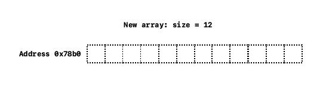

If you have used C++ to program, whether it's for learning purposes or for actual production work, you must have encountered one of the most (not if the most) common container, `vector`.

[`std::vector`](https://en.cppreference.com/w/cpp/container/vector) is a template class provided in the _C++ Standard Template Library_. Thanks to its automatic memory management and abilitity to grow or shrink size when needed, it saves programmers a lot of time and headache when dealing with problems in normal arrays. But how does it come with such powerful methods that make our lives better?

#### Let's get into it!

# History

It's a good idea to know why `vector` was created in the first place. When programmers wanted to store a collection of values of the same type, they used an array. In C, there are two ways to create arrays: on the stack or on the heap.

```c
// Static array (stored on stack)
int arr[] = { 1, 2, 3, 4 ,5, 6, 7, 8 };

// Dynamic array (stored on heap)
// #include <stdlib.h>
int* p = malloc(sizeof(int) * 8);
```

Advantages:

- **Random access** &mdash; It is very easy and fast using pointer offset.
- **Contiguity** &mdash; Storing data in a contiguous memory blocks allows good good cache locality (better than other sequential data structures like linked lists.)

Common disadvantages:

- **No bound checkings** &mdash; The best you can get when attempting to access elements outside of an array is [undefined behavior](https://en.cppreference.com/w/cpp/language/ub), which might work on one day and crash on the other day.
- **Fixed size** &mdash; Whether on stack or on heap, arrays have only a fixed memory space to hold data.
- **Memory management** &mdash; Arrays allocated on the heap need to be manually deallocated by programmers, or memory leaks will occur.
- **Waste of memory** &mdash; Sometimes programmers don't know how many elements they will need, they allocate a very big size array to prevent running outside boundaries from happening. However, this will cause a waste of memory since those empty memory blocks are taken but not being used.

# What is vector?

You start to sense that `vector` is just like an array but more functionalities, and you're right! In fact, `vector` is a class wrapping around an internal array. Every data member and method is built on top of that array.

More precisely, `std::vector` falls into the category [**Sequence Containers**](https://en.cppreference.com/w/cpp/container#Sequence_containers), which are containers that can be accessed sequentially. A rough explanation for what "accessed sequentially" means is that Like the good old C arrays, it allows users to perform pointer-like arithmetic calculation and random access. But now, it also has the abilility to resize itself automatically if needed as well as provides users a set of methods to manually grow or shrink the size by themself.

Another trait of a vector is that inserting an element to the back of the vector is constant time (_most of the time_). Removing the last element is also guaranteed to be constant time.

Finally, vectors will manage allocation and dellocation internally when it deals with creating, inserting, deleting or going out of scope. Users don't need to manage all of those painful tasks mannually.

`vector` comes in play to keep what's best about arrays and try to remove, or at least improve, the weaknesses. Here are few unique traits of `vector`:

- **Safety** &mdash; `vector` provides methods with boundaries checking.
- **Templated** &mdash; `vector` can store arbitary elements which can be primitive data types or custom classes.
- **Random access** &mdash; A `vector` object can be indexed as efficiently as original arrays.
- **Contiguity** &mdash; Elements stored in a `vector` object are in contiguous memory blocks.
- **Dynamic size** &mdash; `vector` is able to handle resizing when it grows or shrinks, automatically and manually.
- **Automatic memory management** &mdash; Unlike arrays stored on the heap that require programmers to manually dellocate the used memory blocks, `vector` will handle that deallocation when a `vector` object goes out of scope (_most of the time_).
- **Easy insertion and deletion** &mdash; `vector` provides powerful and convenient modification methods for every possible use cases. The procedures are totally encapsulated so programmers don't need to scratch their heads when dealing with working elements in a `vector` object.

# How is it managed?

Internally, `std::vector` is built on top of a C-style array. Everything, including data members and methods, is structured and operated around this one array.

However, there are two major ways to maintain the necessary information about that array. Both are interchangeable, validated and accepted by many C++ programmers.

```cpp title=vector.h
// Approach 2
template <typename _Tp>
class vector {
public:
    // public member functions
private:
    _Tp*          _data;      // Storage for all elements
    unsigned int  _capacity;  // Maximum elements can be stored
    unsigned int  _size;      // Current elements are stored
};

// Approach 2
template <typename _Tp>
class vector {
public:
    // public member functions
private:
    _Tp*    _start;     // points to first element
    _Tp*    _end;       // points to one past internal storage
    _Tp*    _finish;    // points to one past last element
};
```

<Alert title="Which one to choose?" status="primary" icon="information">
  <p>
    Although both cases are validated and used interchangeably,&nbsp;
    <code>std::vector</code> uses the second approach in its implementation. Personally,&nbsp;
    I think the second approach will allow you to work directly with pointers to
    access the array instead of using offset (offsets will still be used but minimized).
    Therefore, the article will focues primarily on this structure.
  </p>
</Alert>

# How is it constructed?

To put it simply, the constructors (a special function to initialize vector objects) will examine the input arguments to get the number of elements. This will be the initial size of the new vector object. The vector then allocates an array according to the size, and constructs elements, (3 pointers in the second approach we have discussed above) to fill in the array. Finally, it will update the data members to maintain the array.

Take an example from the _initializer-list_ constructor provided in `std::vector`:

```cpp title=main.cpp
#include <vector>

int main()
{
  std::vector<int> v{ 1, 2, 3, 4, 5, 6, 7, 8 };
}
```

First, it will examine how many element there are in the initializer list, which is 8 in this case. This will determine how many space should be allocated for this new vector object. The size can be computed by many ways:

```cpp
std::initialize_list<int> l = { 1, 2, 3, 4, 5, 6, 7, 8 };

std::size_t n1 = std::distance(l.begin(), l.end()); // = 8
std::size_t n2 = l.size();                          // = 8
```

The allocator, which is passed as a template argument by users, takes the size and determines how many space to allocate for the internal array. This can be achieved through [`allocator_traits::allocate()`](https://en.cppreference.com/w/cpp/memory/allocator_traits/allocate). Then, it will iterate through the initializer list and construct elements with the same value. This is done by [`allocator_traits::construct()`](https://en.cppreference.com/w/cpp/memory/allocator_traits/construct). Finally, it will update the three pointers to manage the internal array.

Here is the simplified version of initializer-list constructor of vector:

```cpp title=vector.h
#include <memory>
#include <initializer_list>

template<typename _Tp>
class vector
{

// Other member methods ...

public:
  constexpr vector(std::initializer_list<_Tp> init)
  {
      using traits_t = std::allocator_traits<allocator>;

      // Determine the size to allocate the new array
      const std::size_t n = init.size();

      // Allocate the new size and _start points to the first item
      this->_start        = traits_t::allocate(_alloc, n);
      this->_finish       = _start;

      // Iterate through initializer list
      for (auto curr = init.begin(); curr != init.end(); curr++)
      {
          // Construct new elements
          traits_t::construct(_alloc, std::addressof(*_finish), *curr);
          _finish++;
      }

      this->_end = _start + n;
  }
};
```

<Summary summary="Range initialization">
  <p>
    Similar constructors as{" "}
    <a>
      <em>copy constructor</em>
    </a>{" "}
    and{" "}
    <a>
      <em>range-based</em>
    </a>{" "}
    can use the same initialization provided in the initializer-list
    constructor. They all determine the size given in a range by calling the{" "}
    <code>size()</code> method and using{" "}
    <code>std::distance(r.begin(), r.end())</code> where <code>begin()</code>{" "}
    and <code>end()</code> are provided to mark the boundary of the range{" "}
    <code>r</code>. They allocate a new array based on the new size, iterate
    through the range and construct elements in the new array.
  </p>
</Summary>

A full list of available constructor can be found [here](https://en.cppreference.com/w/cpp/container/vector/vector).

# What is iterator?

An **_iterator_** can be any object that

- Points to some elements in a range of elements (it could be a STL container or an array).
- Has the ability to iterate through the elements of that range by a provided set of operators (there are at least the increment `operator++()` and dereference `operator*()`).

## Random access iterator

`std::vector` uses [`std::random_access_iterator`](https://cplusplus.com/reference/iterator/RandomAccessIterator/) to work with the internal elements. _Random access iterators_ are iterators that can be used to access elements using pointer offset, and offer the same functionalities as pointers.

<Alert status="warning" icon="warning" title="Note">
  <p>
    <code>std::random_access_iterator</code>
    is not a complete type, but rather a trait to tell which iterator category is
    used in a container. Each container can define its own specific iterator type.
    For example, <a href="https://en.cppreference.com/w/cpp/container/deque">
      <code>std::deque</code>
    </a> also uses random access iterator but how it's implemented is very different
    from what's in <code>vector</code>.
  </p>
  <p>
    For other iterator categories, please refer to{" "}
    <a
      target="_blank"
      href="https://cplusplus.com/reference/iterator/#properties">
      this
    </a>
    .
  </p>
</Alert>

`vector` provides two iterator methods to mark the range of elements

- **`begin()`** &mdash; Returns an iterator pointing the first element in a vector object.
- `end()` &mdash; Returns an iterator pointing one past the last element in a vector object.

<figure>
  
  <figcaption>
    Source:&nbsp;
    <a href="https://en.cppreference.com">https://en.cppreference.com</a>
  </figcaption>
</figure>

## Const iterator

`std::vector` also introduces _const iterators_ via `cbegin()` and `cend()`. A constant iterator in `std::vector` is also a class wrapping around a pointer, but the pointer is a pointer to constant. A _pointer to constant_ allows to modify the pointer itself, but the pointed-to value should not be modified.

Those random access iterator methods can be implemented as below:

```cpp title=vector.h
#include <memory>

template<typename _Tp>
class vector
{

// Other member methods ...

public:
  using iterator        = normal_iterator<_Tp*, vector>;
  using const_iterator  = normal_iterator<const _Tp*, vector>;


  iterator begin()
  {
    return iterator(this->_start);
  }

  const_iterator cbegin() const
  {
    return const_iterator(this->_start);
  }

  iterator end()
  {
    return iterator(this->_finish);
  }

  const_iterator cend() const
  {
    return const_iterator(this->_finish);
  }
};
```

<Summary summary="Normal iterator implementation">
  <p>
    <code>normal_iterator</code> is a simple iterator class wrapping around an
    array pointer. If you're interested in the implementation, you can find it{" "}
    <a
      target="_blank"
      href="https://gist.github.com/richardnguyen99/832ec4ad2ad37733f747756fe39a8c2f">
      here
    </a>
    !
  </p>
</Summary>

## Reverse iterator

Like normal iterators, reverse iterators will go backward when using incremental operators and go forward when using decremental operators. Reverse iterators can be used by calling `rbegin()`, `rend()`, `crbegin()` and `crend()`.

Somewhat similar to normal iterator, `rbegin()` will point to the first element in the _reversed_ sequence and `rend()` will point to one-past the last element in the same _reversed_ seqquence.

<figure>
  
  <figcaption>
    Source:&nbsp;
    <a href="https://en.cppreference.com">https://en.cppreference.com</a>
  </figcaption>
</figure>

```cpp title=main.cpp
#include <iostream>
#include <vector>
#include <algorithm>

int main()
{
  std::vector<int> v{ 1, 2, 3, 4, 5, 6, 7, 8 };

  std::cout << "Forward: { ";
  std::for_each(v.begin(), v.end(), [](const auto& e) {
      std::cout << e << " ";
  });
  std::cout << " }\n";

  std::cout << "Backward: { ";
  std::for_each(v.rbegin(), v.rend(), [](const auto& e) {
      std::cout << e << " ";
  });
  std::cout << " }\n";
}

// Ouput:
// Forward: { 1, 2, 3, 4, 5, 6, 7, 8 }
// Backward: { 8, 7, 6, 5, 4, 3, 2, 1 }
```

# How does inserting work?

Unlike C-style arrays which are fixed after initialization, `std::vector` allows users to add as many elements as they want after initialization. It will handle the growing internally and automatically. But at this point, we all know that `std::vector` is built on top of a C-style array. So how does it work> **TL;DR**

> 1. Check if there is an available space at the end. If yes, go to step 6.
> 2. If not, determine the new size (the old size is doubled mostly).
> 3. Allocate the new array according to the new size.
> 4. Move data from the old one to the new one.
> 5. Free up the space allocated to the old one.
> 6. Construct a new element at the end.
> 7. Update all the necessary data members.?

## Insert at the end

Inserting at the end is the simplest form of insertion provided by `std::vector`. It also guarantees that the operation only takes _amortized_ constant time, $O(1)$, to perform. That's why it's recommended to use `std::vector` if you only append new items at the end.

The operation can be broken down into these steps:

1. Construct a new element at the end pointed by `_finish`
2. Increment `_finish` to maintain the new bound

Assume there is enough space for a new element (there is no reallocation), this operation will take only constant time $O(1)$ regardless how many elements are stored previously.

Let's discuss the simplest inserting operation in `std::vector`. Inserting at the end can be done easily by constructing a new object at the pointer `_end`. Simple, right? That's why vector is efficient for pushing new elements to the end because it guarantees that the time complexity is $O(1)$.

But you will hear many people say that the time complexity is _amortized constant_. The term _amortized time_ can be explained in simple terms.

Basically, adding new elements to the end of a vector takes a constant time regardless of the current size of the vector. But what happens when the array is full and there is no space to allocate and construct a new element?

Then the vector needs determine the new size (`std::vector` simply doubles the old size) and allocates a new array somewhere in memory according to the new size. Then it will move the data from the old array to the newly-allocated array and free the old array. Assume that allocating and dellocating the old array takes constant time (regardless what the old size is), moving each individual item from the old one to the new one takes $O(n)$ in time complexity where $n$ is the size of the old array.

But since this process happens once in while, its _"slowness"_ is diluted away when it's run, say, in a million times. It can be ignored when comparing to the average time taken to perform inserting.

## Insert anywhere

Now, inserting a new element anywhere in the vector is a bit more complicated. The data are stored a contiguous fashion so there is no available space to insert between elements. Therefore, making up space is required.

The process is called _shifting_. It will shift the data in the range `[pos, _finish)` to the right. Specifically, the data will be moved to the range `[pos + 1, _finish + 1)`. But first, it still needs to check if there is enough space to do so. It is done exactly as inserting at the end. After shifting, there will an available space at `pos` to construct a new element.

With the shifting process, inserting a new element anywhere takes $O(n)$ in time complexity where $n$ is the distance from `pos` to `_finish`. Therefore, the worst case is when inserting a new element at the front. That's why inserting at the front of a vector is not recommended due to its overhead.

For example, `insert(v.begin() + 3, 4)`:

<figure>
  
  
  
  <figcaption>
    A simple illustration how inserting an element anywhere works
  </figcaption>
</figure>

## Rellocation for new size

Now, let's talk about the elephant in the roow: **_reallocation_ when a vector object grows**.

Like we discussed above, `std::vector` is built on top of a C array. Accessing and writing to the elements outside the bound of an array is considered [_undefined behavior_](https://en.cppreference.com/w/cpp/language/ub).

To put in a simple term, _undefined behaviors_ guarantees programmers nothing. For example, accessing the elements within the bounds of the array guarantees you the correct result or the thing you want to achieve. However, it's undefined what happens if you go out of bounds. It _might work_ today, on your machine, but it doesn't guarantee to work tomorrow, on a different machine. Basically, anything can happen. It can cause crashing, freezing or if you're lucky, it may works correctly.

Thus, rellocation is necessary when our vector object is running out of space to insert new elements.

Reallocation can be understood as following:

1. Allocate a new array with a new size.
2. Copy the existing elements from the original array to the new one.
3. Destroy elements and free the allocated memory in the old array.
4. Update the three data-member pointers to the new array.

In the first step, the new size can be defined as how you want. To keep it simple, let's just double the original size (this is how `std::vector` handles the new size).

With the new array which has been allocated, we just simply copy the existing elements to the new one. However, since the new array doesn't have any element in it yet, we can avoid repeating the process of copying then shifting. Instead, we will copy elements before `pos`, insert `value` into `pos` and continue to copy the rest to the new array.

<figure>
  
  
  <figcaption>Reallocation for new size</figcaption>
</figure>

# How does deleting work?

Deleting works somewhat similar to inserting. When deleting elements at ends, it guarantees to have constant time complexity $O(1)$. However, when deleting elements at other positions, shifting elements to the left will occur.

## Delete at the end

`vector::erase()` can be used in both cases. The function is passed with a position `pos`, which is a _const iterator_. When `pos == cend() - 1`, which points to the last element in the vector, deleting at end will happen.

1. `_finish` is decremented and now pointing to the last element.
2. Destroy the element pointed by `_finish`.[`std::allocator_traits<std::allocator<T>>::destroy()`](https://en.cppreference.com/w/cpp/memory/allocator_traits/destroy) is used to perform this task internally.

<figure>
  
  
  
  <figcaption>Vector delete at end</figcaption>
</figure>

Thanks to the internal pointer `_finish`, deleting at end will be always $O(1)$ because it directly destroys the element pointed by `_finish` without knowing how many elements are stored before.

## Delete anywhere

Things are getting a bit tricky when deleting an element somewhere else except the end. Deleting a random element will leave a hole in the array and that will break the contiguity of array. This is when shifting happens.

Again, `vector::erase()` will take the parameter `pos`. When `pos != cend() - 1`, which points to everywhere except the last element, this case will occur.

1. Move elements in the range `[pos + 1, cend())` to to a new range start at `pos`. This taks can be achieved with [`std::move`](https://en.cppreference.com/w/cpp/algorithm/move).
2. `_finish` is decremented and now pointing to the last element.
3. Destroy the element pointed by `_finish`.[`std::allocator_traits<std::allocator<T>>::destroy()`](https://en.cppreference.com/w/cpp/memory/allocator_traits/destroy) is used to perform this task internally.

<figure>
  
  
  
  
  
  <figcaption>Vector delete everywhere</figcaption>
</figure>
