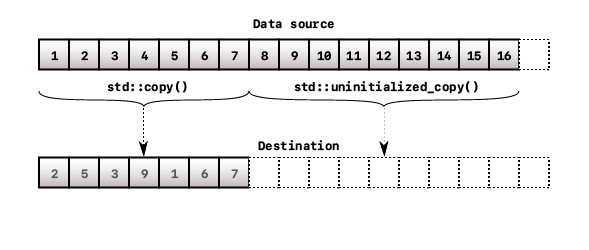
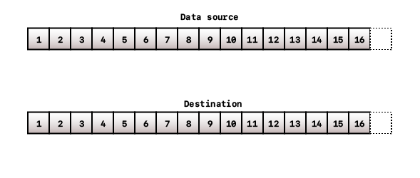
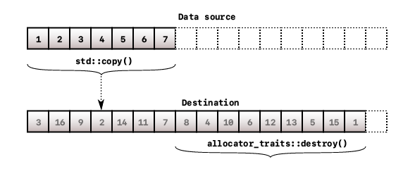
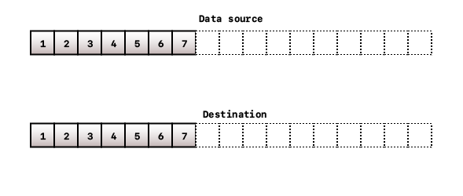
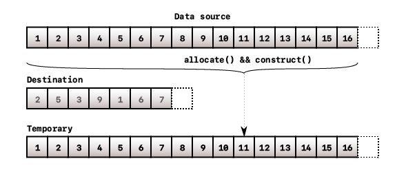
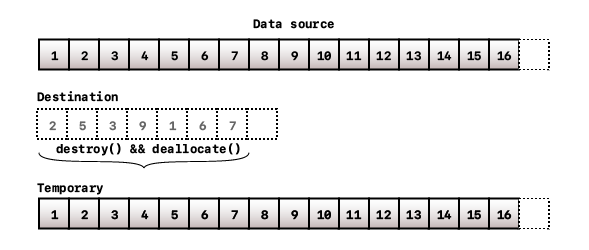
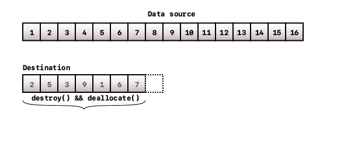
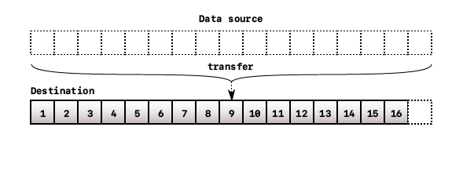

In the <Link to="/articles/rebuild-cpp-vector-p1">previous article</Link>, we have talked about the needed layout to construct a vector object. Now, we will be talking about how to construct one.

# What is constructors?

Constructors, in a simple term, are special methods that intialize objects of a given type. They can be used to set the initial data members of the type, either to default or to specified values.

Same as vector, it has three data members to keep track of the internal array. So the constructors are there to provide programmers a way to initialize those data members.

# Vector constructors

`std::vector` provides a variety of constructors to initialize a vector object.

## Default constructor

A _default destructor_ will **zero-initialize** all of the three data members. This basically tells you that there is no internal array managed by this vector object, or so-called _empty vector_. Thus all three pointers are `nullptr`.

An easy way to initialize an empty vector is, as mentioned above, initialize all three data members to null.

#### Implementation

```cpp title=vector.h
template <typename T>
class vector
{
public:
    ...
    vector()
    : _start(), _finish(), _end() { }

private:
    ...
};
```

After calling this constructor, all pointers will be pointing to `0`, or have a value of `0x0`. This guarantees no allocation will occur.

### Complexity

- Time: Constant $O(1)$
- Space: Constant $O(1)$

## Fill constructor

Fill constructors are to construct vector objects by filling them with a pre-determined number of copies of a value.

These constructors are useful if you already know how many elements you will be using and what their values are.

### Default-inserted fill constructor

This constructor will initialize a vector object and fill it with a number of default instances of the type.

#### Implementation

```cpp title=vector.h
template <typename T>
class vector
{
public:
  ...
  vector(size_type count)
  {
    this->_start  = allocator_traits::allocate(this->_alloc, count);
    this->_end    = this->_start + count;
    this->_finish = this->_start;

    for (; count > 0; --count, ++this->_finish)
      allocator_traits::construct(this->_alloc, this->_finish);
  }
  ...
private:
  ...
};
```

#### Usage

```cpp
vector<std::string> v(8);
```

### Copied fill constructor

This constructor will initialize a vector object and fill it with a number of copies of a given value.

#### Implementation

```cpp title=vector.h

template <typename T>
class vector
{
public:
  ...
  vector(size_type count, const_reference value)
  {
    this->_start  = allocator_traits::allocate(this->_alloc, count);
    this->_end    = this->_start + count;
    this->_finish = this->_start;

    for (; count > 0; --count, ++this->_finish)
      allocator_traits::construct(this->_alloc, this->_finish, value);

  }
  ...

private:
  ...
};
```

#### Usage

```cpp
vector<string::string> v(5, "Hello");
// { "Hello", "Hello", "Hello", "Hello", "Hello" }
```

### Complexity

- Time: Linear $\text{O(n)}$ with $\text{n}$ is the number of elements, which is `count`. We need to iterate through `count` elements and construct every single one into the allocated internal array.
- Space: Linear $\text{O(n)}$ with $\text{n}$ is the number of elements, which is `count`. `count` elements will be allocated to the internal array.

## Range-based constructor

Fill constructors are great, but they only initialize vector objects filled with the same value. We want something more diverse.

Range-based constructor allows programmers to initialize vector objects filled with a copy of the elements in a given range. It could be an array or other containers.

#### Implementation

```cpp title=vector.h
template <typename T>
class vector
{
public:
  ...
  template<typename InputIter>
  vector(InputIter first, InputIter last)
  {
    const size_type n = std::distance(first, last);
    this->_start      = allocator_traits::allocate(this->_alloc, n);
    this->_end        = this->_start + n;
    this->_finish = this->_start;

    for (; first != last; ++first, ++this->_finish)
        allocator_traits::construct(
            this->_alloc, std::addressof(*(this->_finish)), *first);
  }
  ...

private:
  ...
};
```

With this implementation, you can pass two iterators `first` and `last` to mark the range of elements, `[first,last)`. The requirement are that both iterators must be [Input Iterator](https://cplusplus.com/reference/iterator/InputIterator/) or above, and the type of element to which both iterators point are copy-constructible.

However, there is an ambiguity with **copied-fill constructor**. For example, `vector(8,5)` might result in `vector<T>::vector(InputIter, InputIter) [with InputIter = int; T = int]` while **copied-fill constructors** has parameters whose types are `unsigned int` and `const T&` (in this case, `T` is `int`).

Therefore, we should only enable **range-based constructor** if the arguments are both _input iterators_ at compile time. Luckily, C++ has [`std::enable_if`](https://en.cppreference.com/w/cpp/types/enable_if) to check that.

```cpp
template <typename InputIter,
          typename = typename std::enable_if<std::is_convertible<
              typename std::iterator_traits<InputIter>::iterator_category,
              std::input_iterator_tag>::value>::type>
vector(InputIter first, InputIter last)
{
  ...
}
```

Don't get intimidated by that guard check! It's called [metaprogramming](https://en.cppreference.com/w/cpp/meta). `std::enable_if` will _conditionally_ remove a function overload or template specialization. The condition, in this case, is that the template argument is an input iterator or higher.

<Summary summary="Breakdown">
  <p>Let's go from the inner so that we understand what it's going here: </p>
  <ul>
    <li>
      <a href="https://en.cppreference.com/w/cpp/iterator/iterator_traits">
        <code>
          typename std::iterator_traits&lt;InputIter&gt;::iterator_category (1)
        </code>
      </a>
      <p>
        This will extract what type of iterator the argument iterator is. For
        example, <code>deque</code> and <code>vector</code> use{" "}
        <code>random_access_iterator_tag</code> for their iterator meanwhile{" "}
        <code>forwward_list</code> uses <code>forward_iterator_tag</code> and{" "}
        <code>list</code> uses <code>bidirectional_iterator_tag</code> for their
        iterator.
      </p>
    </li>
    <li>
      <a href="https://en.cppreference.com/w/cpp/types/is_convertible">
        <code>
          std::is_convertible&lt;(1), std::input_iterator_tag&gt;::value (2)
        </code>
      </a>
      <p>
        This will check if the iterator extracted from <code>(1)</code> can be
        converted to
        <code>input_iterator_tag</code>. If yes, <code>::value</code> will yield{" "}
        <code>true</code>, or <code>false</code> if otherwise.
      </p>
      <p>
        Since the <code>input_iterator_tag</code> is the lowest form of iterator
        type that can be iterated and read. More importantly, other iterators
        are inherited from this tag so checking the convertability is to make
        sure the iterator has the core functionality to iterate and read without
        worrying about other stuff.
      </p>
    </li>
    <li>
      <a href="https://en.cppreference.com/w/cpp/types/enable_if">
        <code>typename std::enable_if&lt;(2)&gt;::type</code>
      </a>
      <p>
        This will enable this overload if and only if the type is input iterator
        or higher.
      </p>
    </li>
  </ul>
</Summary>

#### Usage

```cpp
std::deque<int> std_deque(8, 5);
vector<int> v(std_deque.begin(), std_deque.end());
// v: { 5, 5, 5, 5, 5, 5, 5, 5 }
```

#### Complexity

- Time: Linear $\text{O(n)}$ with $\text{n}$ is the number of elements in the range $\text{[first, last)}$. We need to iterate through $\text{n}$ elements and construct every single one into the allocated internal array.
- Space: Linear $\text{O(n)}$ with $\text{n}$ is the number of elements in the range $\text{[first, last)}$.

## Copy constructor

Copy constructor will initialize a vector object by copying data members from an existing vector object to this newly-created one. The beauty of copy constructor is that modifying one vector will have no affect on the other.

#### Implementation

The implementation for copy constructor is somewhat similar to range-based constructor. Vector has a range of elements that we can use to construct another range. We just need to tweak it a little bit to fit our desire.

```cpp title=vector.h
template <typename T>
class vector
{
public:
  ...
  vector(const vector& other)
  {
    const size_type n = other._finish - other._start;
    this->_start      = allocator_traits::allocate(this->_alloc, n);
    this->_end        = this->_start + n;
    this->_finish     = this->_start;

    for (size_type i = 0; i < n; ++i, ++this->_finish)
      allocator_traits::construct(this->_alloc, this->_finish,
                                        *(other._start + i));
  }
  ...

private:
  ...
};
```

Note that this implementation only allocates enough space and constructs the same elements existing in `other` vector object, which means the extra empty memory blocks that are allocated in `other`, if there is, will not be used to allocate in the new one.

#### Usage

```cpp
std::vector<std::string> stdv = {"Hello", "World"};
vector<std::string> v1(stdv.begin(), stdv.end());
vector<std::string> v2(v1);
// v2: { "Hello", "World" }
```

#### Complexity

- Time: Linear $\text{O(n)}$ with $\text{n}$ is the number of elements in `other` vector`.
- Space: Same as time complexity.

## Move constructor

Unlike copy constructor, move constructor will transfer the ownership of the internal array from `other` vector to the newly-created one. The most important part of move constructor, not just in vector, is that it guarantees no allocation occurs.

#### Implementation

So the idea is that we want the three pointers from the new vector object to manage the internal array allocated in the old vector object. We can just simply assign the addresses held by the old one to the pointers in the new one. And zero initializing the pointers in the old will suffice.

```cpp
vector(vector&& other)
: _start(other._start), _finish(other._finish), _end(other._end)
{
  other._start  = pointer();
  other._finish = pointer();
  other._end    = pointer();
}
```

#### Usage

```cpp
std::vector<std::string> stdv = {"Hello", "Richard", "Nguyen"};
vector<std::string> v(stdv.begin(), stdv.end());
vector<std::string> v2(std::move(v));
```

#### Complexity

- Time: Constant $O(1)$. By transferring ownerships, it doesn't matter how many elements are stored in the old vector object.
- Space: There is no new memory block allocated.

## Initializer-list constructor

Constructing with an initializer list allows programmers to initialize a vector object with how many elements there are and what each value is explicitly.

For example, how can you initialize a vector of integers object that initially contains `{1, 3, 5, 7, 9}` with these provided constructors so far?

#### Implementation

In a simple description, an initializer list will let you pass an array-like argument to specify explicitly each element's value. It turns out that `std::initializer_list` can be used as a range of elements. We can reuse the <Link to="articles/rebuild-cpp-vector-p2/#range-based-constructor">range-based constructor</Link>'s implementation.

```cpp
#include <initializer_list> // std::initializer_list

vector(std::initializer_list<value_type> init)
{
    const size_type n = std::distance(init.begin(), init.end());
    this->_start      = allocator_traits::allocate(this->_alloc, n);
    this->_end        = this->_start + n;
    this->_finish = this->_start;

    for (size_type i = 0; i < n; ++i, ++this->_finish)
      allocator_traits::construct(
          this->_alloc, this->_finish, *(init.begin() + i));
}
```

#### Usage

```cpp
vector<int> v{ 1, 2, 3, 4, 5, 6, 7, 8 };
```

#### Complexity

- Time: Linear $\text{O(n)}$ with $\text{n}$ is the number of elements in the `std::initializer_list`.
- Space: Linear $\text{O(n)}$. $\text{n}$ spaces will be allocated.

# Assignment operators

Assignment operators are overloads of `operator=()` to replace one vector's contents with the other's.

## Copy Assignment

Copy assigment is similar to copy constructor in a way that assigned elements will be the same but distinguish from the original. However, there are some extra steps to deal with specific scenarios.

First, we need to check if the data source and the destination are identical. If yes, we don't do anything. Otherwise, we need to examine the following cases.

The first case is that there is sufficient space and the size of the current vector object is less than that of the source. In this case, we only need to copy from the data source to the destination.

<figure>
  
  
  <figcaption>Vector copy assignment: Scenario 1</figcaption>
</figure>

The next case we need to consider is that there is still enough space to assign but the size of the current vector object is equal to or more than that of the source. In this case, we still need to copy from the data source to the destination and, additionally, destroy extra elements if applicable.

<figure>
  
  
  <figcaption>Vector copy assignment: Scenario 2</figcaption>
</figure>

The final case is that there is not enough space to assign the content from the other vector to the new one. In this case, reallocation is required. Specifically, we need to create a temporary array from the data source. Next, we need to destroy the elements and deallocate the space allocated in the original array. Finally, we need to reassign the data members to manage the newly-allocated array.

<figure>
  
  
  
  <figcaption>Vector copy assignment: Scenario 3</figcaption>
</figure>

#### Implementation

After examining all the possible cases, there are something we still need to consider.

- **Chained assignment** &mdash; This allows chained assignments among many vector objects such as `v1 = v2 = v3`.
- **Immutable data source** &mdash; This enforces our implementation to not compromise the elements in the data source.

```cpp
vector &
operator=(const vector &other)
{
    if (&other == this)
        return *this;

    const size_type other_len = other._finish - other._start;
    const size_type this_len  = this->_finish - this->_start;
    const size_type this_cap  = this->_end - this->_start;

    // Scenerio 3
    if (other_len > this_cap)
    {
        pointer tmp = allocator_traits::allocate(this->_alloc, other_len);
        std::uninitialized_copy(other._start, other._finish, tmp);

        std::destroy(this->_start, this->_finish);
        allocator_traits::deallocate(this->_alloc, this->_start, this_cap);

        this->_start = tmp;
        this->_end   = this->_start + other_len;
    }
    // Scenario 2
    else if (this_len >= other_len)
    {
        pointer tmp = std::copy(other._start, other._finish, this->_start);

        std::destroy(tmp, this->_finish);
    }
    // Scenario 1
    else
    {
        std::copy(other._start, other._start + this_len, this->_start);
        std::uninitialized_copy(other._start + this_len, other._finish,
                                this->_finish);
    }

    this->_finish = this->_start + other_len;

    return *this;
}
```

#### Usage

```cpp
vector<int> v1{1, 2, 3, 4, 5, 6, 7, 8, 9, 10};
vector<int> empty_v;

empty_v = v1;
// empty_v: {1, 2, 3, 4, 5, 6, 7, 8, 9, 10}
// v1: {1, 2, 3, 4, 5, 6, 7, 8, 9, 10}
```

#### Complexity

- Time: Linear $O(n + m)$ where $n$ and $m$ are the length of the source vector and the destination vector respectively.
- Space: In Scenario 3, allocation a temporary array is required, so it's $O(n)$ where $n$ is the length of the source vector. In other cases, no allocation is performed, thus the complexity is constant $O(1)$.

## Move Assignment

Move assignment is similar to the move constructor in a way that it will transfer the ownership of the internal array from one vector object to another. The only difference now is that we need to destroy and deallocate the old data contained inside the the destination vector, if it's not empty.

It's a bit easier to implement than the copy assignment but the old data will be deleted anyway.

<figure>
  
  
  <figcaption>Vector move assignment</figcaption>
</figure>

#### Implementation

```cpp
vector &
operator=(vector &&other)
{
    if (&other == this)
        return *this;

    std::destroy(this->_start, this->_finish);
    allocator_traits::deallocate(this->_alloc, this->_start,
                                  this->_end - this->_start);

    this->_start  = other._start;
    this->_finish = other._finish;
    this->_end    = other._end;

    other._start  = pointer();
    other._finish = pointer();
    other._end    = pointer();

    return *this;
}
```

#### Usage

```cpp
vector<int> v1{1, 2, 3, 4, 5, 6, 7, 8, 9, 10};
vector<int> empty_v;

empty_v = v1;
// empty_v: {1, 2, 3, 4, 5, 6, 7, 8, 9, 10}
// v1: { }
```

#### Complexity

- Time: Linear $O(n)$ where $n$ is the length of the destination vector due to the destroying process of its old data.
- Space: Constant $O(1)$. No new allocation is performed regardless the inputs.

## Initializer-list assignment

Assignment with an initializer list can be implemented as the copy assignment. However, instead of using pointers as in the copy assignment, iterators will be used to iterate elements.

#### Implementation

```cpp
vector &
operator=(std::initializer_list<value_type> init)
{
    const size_type init_len = std::distance(init.begin(), init.end());
    const size_type this_len = this->_finish - this->_start;
    const size_type this_cap = this->_end - this->_start;

    // Scenerio 3
    if (init_len > this_cap)
    {
        pointer tmp = allocator_traits::allocate(this->_alloc, init_len);
        std::uninitialized_copy(init.begin(), init.end(), tmp);

        std::destroy(this->_start, this->_finish);
        allocator_traits::deallocate(this->_alloc, this->_start, this_cap);

        this->_start = tmp;
        this->_end   = this->_start + init_len;
    }
    // Scenario 2
    else if (this_len >= init_len)
    {
        pointer tmp = std::copy(init.begin(), init.end(), this->_start);

        std::destroy(tmp, this->_finish);
    }
    // Scenario 1
    else
    {
        std::copy(init.begin(), init.begin() + this_len, this->_start);
        std::uninitialized_copy(init.begin() + this_len, init.end(),
                                this->_finish);
    }

    this->_finish = this->_start + init_len;

    return *this;
}
```

#### Usage

```cpp
vector<int> init_v;
init_v = {1, 2, 3, 4, 5, 6, 7, 8, 9, 10};
```

#### Complexity

- Time: Linear $O(n + m)$ where $n$ and $m$ are the length of the initializer list and the destination vector respectively.
- Space: In Scenario 3, allocation a temporary array is required, so it's $O(n)$ where $n$ is the length of the initialize list. In other cases, no allocation is performed, thus the complexity is constant $O(1)$.

# `assign` overloads

`assign()` overloads are similar to `operator=` overloads. Its main purpose is to replace the contents with those of another vector. Exactly the same as `operator=`, right? However, `operator=` overloads only support a single object as its argument. They cannot be performed when more arguments are required like assigning a range from other containers to an existing vector object.

## Assign range

Assigning a range of elements to an existing vector object can be derived from the copy assignment and the range constructor.

#### Implementation

Similar to the range constructor, we need `std::enable_if` to guarantee that this overload can be used if and only if the template argument is an input iterator type.

```cpp
template <typename InputIter,
          typename = typename std::enable_if<std::is_convertible<
              typename std::iterator_traits<InputIter>::iterator_category,
              std::input_iterator_tag>::value>::type>
void
assign(InputIter first, InputIter last)
{
    const size_type init_len = std::distance(first, last);
    const size_type this_len = this->_finish - this->_start;
    const size_type this_cap = this->_end - this->_start;

    // Scenerio 3
    if (init_len > this_cap)
    {
        pointer tmp = allocator_traits::allocate(this->_alloc, init_len);
        std::uninitialized_copy(first, last, tmp);

        std::destroy(this->_start, this->_finish);
        allocator_traits::deallocate(this->_alloc, this->_start, this_cap);

        this->_start = tmp;
        this->_end   = this->_start + init_len;
    }
    // Scenario 2
    else if (this_len >= init_len)
    {
        pointer tmp = std::copy(first, last, this->_start);

        std::destroy(tmp, this->_finish);
    }
    // Scenario 1
    else
    {
        std::copy(first, first + this_len, this->_start);
        std::uninitialized_copy(first + this_len, last, this->_finish);
    }

    this->_finish = this->_start + init_len;
}
```

#### Usage

```cpp
std::deque<int> d{1, 3, 5, 7, 9, 11, 13, 15};
vector<int> init_v;
init_v.assign(d.begin(), d.end());
```

#### Complexity

- Time: Linear $O(n + m)$ where $n$ and $m$ are the length of the range and the destination vector respectively.
- Space: In Scenario 3, allocation a temporary array is required, so it's $O(n)$ where $n$ is the length of the range. In other cases, no allocation is performed, thus the complexity is constant $O(1)$.

## Assign `count` copies

This overload is similar to <Link href="/articles/rebuild-cpp-vector-p2/#fill-constructor">fill constructor</Link>. It replaces the contents with a number of elements specified by this overload.

#### Implementation

```cpp
void
assign(size_type count, const_reference value)
{
    const size_type this_len = this->_finish - this->_start;
    const size_type this_cap = this->_end - this->_start;

    // Scenerio 3
    if (count > this_cap)
    {
        vector tmp(count, value);

        *this = std::move(tmp);
    }
    // Scenario 2
    else if (this_len >= count)
    {
        pointer tmp = std::fill_n(this->_start, count, value);

        std::destroy(tmp, this->_finish);
    }
    // Scenario 1
    else
    {
        pointer tmp = std::fill_n(this->_start, this_len, value);
        std::uninitialized_fill_n(tmp, count - this_len, value);
    }

    this->_finish = this->_start + count;
}
```

#### Usage

```cpp
vector<int> init_v;
init_v.assign(12, -1);
```

#### Complexity

- Time: Linear $O(n + m)$ where $n$ and $m$ are the number of elements to assign and the destination vector respectively.
- Space: In Scenario 3, allocation a temporary array is required, so it's $O(n)$ where $n$ is the number of elements to assign. In other cases, no allocation is performed, thus the complexity is constant $O(1)$.

## Assign initializer list

This overload can be re-implemented as the same as the initializer-list assigment. To keep it simple, refer to <Link href="/articles/rebuild-cpp-vector-p2/#initializer-list-assignment">this</Link>.

# Destructor

There are two things to consider when designing a destructor for a vector object.

First, vector is in charge of destroying its own elements. For trivial types, like integral types, this process can be ignored. However, if the elements are custom-class, or user-defined, and more importantly, the elements have some data allocated on the heap, destroying is necessary to prevent a memory leak. The destroying process, or the destructor, of the type must be provided by the class itself; vector just simply calls `::destroy` to trigger that process.

Then, vector deallocates and returns the memory blocks, which it used to store the elements, back to the system. The deallocation will be performed by the vector itself.

#### Implementation

```cpp
~vector()
{
    std::destroy(this->_start, this->_finish);
    allocator_traits::deallocate(this->_alloc, this->_start,
                                  this->_end - this->_start);
}
```

#### Usage

We can check the following driver by comparing with no destructor, and with `std::vector`. The check is run with [valgrind](https://valgrind.org/) with the following command:

```sh fontSize=16
$ g++ -Wall -Werror -Wextra vector.cpp -o main -std=c++20
$ valgrind --track-origins=yes --leak-check=full --error-exitcode=1 ./main
```

```cpp title=vector.cpp
#include <deque>    // std::deque
#include <iostream> // std::cout
#include <vector>   // std::vector

#include "vector.h" // vector

int
main()
{
    vector<int> empty_v;           // { }
    vector<int> fill_default_v(8); // { 0, 0, 0, 0, 0, 0, 0, 0}
    vector<int> fill_copy_v(8, 5); // { 5, 5, 5, 5, 5, 5, 5, 5 }
    vector<int> stdv{1, 2, 3, 4, 5, 6, 7, 8};
    vector<int> range_v(stdv.begin(),
                        stdv.end()); // { 1, 2, 3, 4, 5, 6, 7, 8 }
    vector<int> copy_v(range_v);     // { 1, 2, 3, 4, 5, 6, 7, 8 }
    vector<int> move_v(range_v);
    vector<int> init_v;
    vector<int> init_v1{1, 2, 3, 4, 5, 6, 7, 8, 9, 10};

    std::deque<int> d{1, 3, 5, 7, 9, 11, 13, 15};

    init_v  = stdv;
    init_v1 = std::move(init_v);
    init_v1 = {2, 4, 6, 8, 10, 12, 14, 16};
    init_v1.assign(d.begin(), d.end());
    init_v1.assign(12, -1);
}
```

```text title=no-destructor fontSize=13
==3428== Memcheck, a memory error detector
==3428== Copyright (C) 2002-2017, and GNU GPL'd, by Julian Seward et al.
==3428== Using Valgrind-3.18.1 and LibVEX; rerun with -h for copyright info
==3428== Command: ./main
==3428==
==3428== HEAP SUMMARY:
==3428==     in use at exit: 240 bytes in 7 blocks
==3428==   total heap usage: 12 allocs, 5 frees, 73,592 bytes allocated
==3428==
==3428== 32 bytes in 1 blocks are definitely lost in loss record 1 of 7
...
==3428==
==3428== LEAK SUMMARY:
==3428==    definitely lost: 240 bytes in 7 blocks
==3428==    indirectly lost: 0 bytes in 0 blocks
==3428==      possibly lost: 0 bytes in 0 blocks
==3428==    still reachable: 0 bytes in 0 blocks
==3428==         suppressed: 0 bytes in 0 blocks
==3428==
==3428== For lists of detected and suppressed errors, rerun with: -s
==3428== ERROR SUMMARY: 7 errors from 7 contexts (suppressed: 0 from 0)
```

As we can see, there is memory leak occurring. Now, with the destructor implemented, the memory leak should be gone.

```text title=with-destructor fontSize=13
==4122== Memcheck, a memory error detector
==4122== Copyright (C) 2002-2017, and GNU GPL'd, by Julian Seward et al.
==4122== Using Valgrind-3.18.1 and LibVEX; rerun with -h for copyright info
==4122== Command: ./main
==4122==
==4122==
==4122== HEAP SUMMARY:
==4122==     in use at exit: 0 bytes in 0 blocks
==4122==   total heap usage: 12 allocs, 12 frees, 73,592 bytes allocated
==4122==
==4122== All heap blocks were freed -- no leaks are possible
==4122==
==4122== For lists of detected and suppressed errors, rerun with: -s
==4122== ERROR SUMMARY: 0 errors from 0 contexts (suppressed: 0 from 0)
```

Now, `valgrind` tells us that there is no memory leak since all blocks are freed and returned back to the memory pool. Additionally, we can check against `std::vector` by adding the prefix `std::` in front of `vector` in the driver.

```text title=std-vector fontSize=13
==4240== Memcheck, a memory error detector
==4240== Copyright (C) 2002-2017, and GNU GPL'd, by Julian Seward et al.
==4240== Using Valgrind-3.18.1 and LibVEX; rerun with -h for copyright info
==4240== Command: ./main
==4240==
==4240==
==4240== HEAP SUMMARY:
==4240==     in use at exit: 0 bytes in 0 blocks
==4240==   total heap usage: 12 allocs, 12 frees, 73,592 bytes allocated
==4240==
==4240== All heap blocks were freed -- no leaks are possible
==4240==
==4240== For lists of detected and suppressed errors, rerun with: -s
==4240== ERROR SUMMARY: 0 errors from 0 contexts (suppressed: 0 from 0)
```

The allocated bytes in both cases are the same, which means our custom vector is efficient as `std::vector`, at least in allocation.

# Conclusion

Constructing is the first essential step to work with a vector object. Beyond is the _oversimplifed_ version of constructors defined in `std::vector`. Since the article focuses on the core functionalities how to construct a vector object, many other concepts such as `constexpr` and `noexcept` are removed to make the implementations less complicated.

One more note is that there are some duplicates in these implementation. You can try to create a helper function to cover some similar cases.

The full implementation for this article can be found [here](https://gist.github.com/richardnguyen99/8d175dba04fab801f61adf8f0dcb3308/357f62edea33cd95b1fd54781b6c84477ea3841c).
