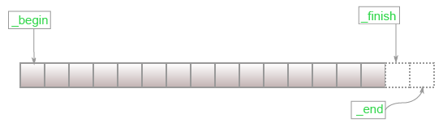
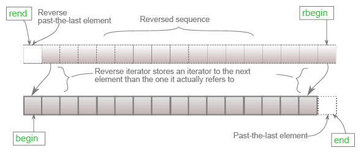

In the <Link to="/articles/rebuild-cpp-vector-p2">previous post</Link>, we figured out how to initialize a vector object. There are a lot of stuff we need to do to complete our built-from-scratch vector.

However, those functions heavily rely on [iterators](https://cplusplus.com/reference/iterator/). Therefore, before getting into the heavy stuff, having a set of well-defined iterator methods can help us write other functionalities more easily.

# What is iterator?

According to [cplusplus.com](https://cplusplus.com)'s definition, an **iterator** is any object that points to some elements in the range and has the ability to iterate through those elements.

The purpose of iterators is to build a unified set of methods that might share the names such as `begin()` and `end()` but have different implementation.

For example, iterators in `std::vector` and `std::deque` are categorized as `random_access_iterator_tag` and have the same iterator method names. But their implementation are very different. While `std::vector`'s iterator is basically pointer, `std::deque`'s iterator is an actual custom class.

# Vector iterator

As mentioned above, vector iterators can be boiled down to pointers thanks to the contiguous memory blocks. Just like pointers, vector iterator can iterate through a range and dereference the elements to get the stored value.

Vector iterators also has the ability to move forward or backward, one step or many steps using pointer offsets. They allow inequality comparisons between themselves. We can use `operator[]` to dereference using offset.

There are many types of iterator defined in `std::vector`.

- Regular iterator is an itertor that behaves just like a normal pointer.
- Const iterator is like regular iterator but it's a _pointer-to-constant_, which allows you to modify the pointer itself such as by moving but the object to which the pointer points shall not be modified.
- Reverse iterator is like regular iterator. However, it will go the opposite direction to normal iterator when using the same moving operators.
- Const-reverse iterator is a combination of const iterator and reverse iterator.

<Alert title="Iterator in std::vector" status="warning" icon="info">
  <p>
    <code>std::vector</code> doesn't use raw pointers for its iterators. In
    fact, they're written under the name <code>__normal_iterator</code>.
    However, it's an internal class and not supposed to be used by users. Its
    purpose is to convert an iterator that is not a class, i.e a pointer, into
    an iterator that is class. The conversion will not change the semantics of
    any of the operators of that pointer.
  </p>
</Alert>

## Regular iterator

<figure>
  
  <figcaption>
    Range-begin-end (Source:
    <a href="https://en.cppreference.com/w/cpp/container/vector/begin">
      https://en.cppreference.com/w/cpp/container/vector/begin
    </a>)
  </figcaption>
</figure>

### `begin()`, `end()`

`begin()` returns an iterator to the first element of the vector object while `end()` returns an iterator to one-past the last element.

#### Implementation

```cpp title=vector.h
...
iterator
begin()
{
    return iterator(this->_start);
}

iterator
end()
{
    return iterator(this->_finish);
}
```

#### Usage

```cpp
std::vector<int> init_v1{1, 2, 3, 4, 5, 6, 7, 8, 9, 10};

std::for_each(v.begin(), v.end(),
              [](auto &e) { std::cout << e << " "; });
std::cout << "\n";

// 1, 2, 3, 4, 5, 6, 7, 8, 9, 10
```

### `cbegin()`, `cend()`

`cbegin()` and `cend()` are the constant versions of `begin()` and `end()` respectively. Masked with `const_iterator`, the elements pointed to will not be modified. The `const` to the methods behaves as a safe guard that no data members, i.e `_start` and `_finish` will not be modified.

```cpp title=vector.h
...
const_iterator
cbegin() const
{
    return const_iterator(this->_start);
}

const_iterator
cend() const
{
    return const_iterator(this->_finish);
}
```

#### Usage

```cpp
std::vector<int> init_v1{1, 2, 3, 4, 5, 6, 7, 8, 9, 10};

std::for_each(v.cbegin(), v.cend(),
              [](const auto &e) { std::cout << e << " "; });
std::cout << "\n";

// 1, 2, 3, 4, 5, 6, 7, 8, 9, 10
```

## Reverse iterator

<figure>
  
  <figcaption>
    Range-rbegin-rend (Source:
    <a href="https://en.cppreference.com/w/cpp/container/vector/rbegin">
      https://en.cppreference.com/w/cpp/container/vector/rbegin
    </a>)
  </figcaption>
</figure>

### `rbegin()`, `rend()`

`rbegin()` returns a reverse iterator to the first element of the reversed vector. It points to the last element if the vector is not reversed.

`rend()` returns a reverse iterator to one-past the last element of the reversed vector. It points to the one before the first element if the vector is not reversed. Because the element doesn't belong to the vector and it acts like a placeholder for marking the range, attempts to access or dereference it might cause an undefined behavior.

```cpp title=vector.h
...
reverse_iterator
rbegin() noexcept
{
  return reverse_iterator(end());
}

reverse_iterator
rend() noexcept
{
  return reverse_iterator(begin());
}
```

#### Usage

```cpp
std::vector<int> init_v1{1, 2, 3, 4, 5, 6, 7, 8, 9, 10};

std::for_each(v.rbegin(), v.rend(),
              [](auto &e) { std::cout << e << " "; });
std::cout << "\n";
// 10, 9, 8, 7, 6, 5, 4, 3, 2, 1
```

### `crbegin()`, `crend()`

`cbegin()` and `cend()` are the constant versions of `rbegin()` and `rend()` respectively. Masked with `const_reverse_iterator`, the elements pointed to will not be modified. The `const` to the methods behaves as a safe guard that no data members, i.e `_start` and `_finish` will not be modified.

#### Usage

```cpp
std::vector<int> init_v1{1, 2, 3, 4, 5, 6, 7, 8, 9, 10};

std::for_each(v.crbegin(), v.crend(),
              [](const auto &e) { std::cout << e << " "; });
std::cout << "\n";
// 10, 9, 8, 7, 6, 5, 4, 3, 2, 1
```

# Conclusion

Vector iterator is easy to implement thanks to its natural traits of normal pointers. By creating a unified set of iterating methods, vector can be used in generic programming among other containers and let users focus solely on iteration instead of its implementation.

# Reference

- [https://cplusplus.com/reference/iterator/](https://cplusplus.com/reference/iterator/)
- [https://en.cppreference.com/w/cpp/container/vector/begin](https://en.cppreference.com/w/cpp/container/vector/begin)
