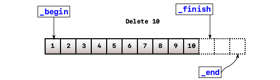
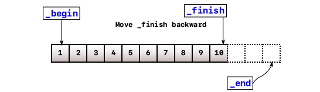
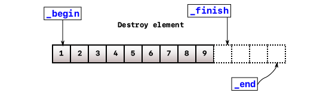
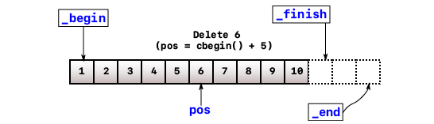
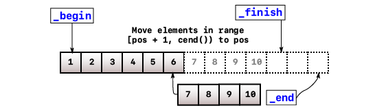
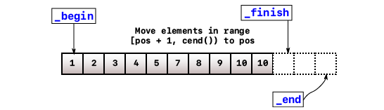
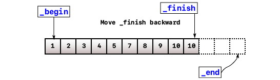
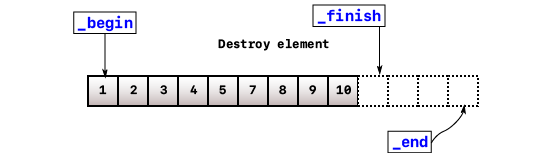

The _C++ Standard Template Library_ (or STL for short) has been around in the C++ comunnity for decades. It provides a set of C++ template classes and functions to support common data structures like [`std::vector`](https://en.cppreference.com/w/cpp/container/vector).

# What is vector?

`std::vector` falls into the category [**Sequence Containers**](https://en.cppreference.com/w/cpp/container#Sequence_containers), which are containers that can be accessed sequentially. Like the good old C arrays, it allows users to perform pointer-like arithmetic calculation and random access. But now, it also has the abilility to resize itself automatically if needed as well as provides users a set of methods to manually grow or shrink the size by themself.

Another trait of a vector is that inserting an element to the back of the vector is constant time (_most of the time_). Removing the last element is also guaranteed to be constant time.

Finally, vectors will manage allocation and dellocation internally when it deals with creating, inserting, deleting or going out of scope. Users don't need to manage all of those painful tasks mannually.

# How is it managed?

Internally, `std::vector` is built on top of a C-style array. Everything, including data members and methods, is structured and operated around this one array.

However, there are two major ways to maintain the necessary information about that array. Both are interchangeable, validated and accepted by many C++ programmers.

```cpp title=vector.h
// Approach 2
template <typename _Tp>
class vector {
public:
    // public member functions
private:
    _Tp*          _data;      // Storage for all elements
    unsigned int  _capacity;  // Maximum elements can be stored
    unsigned int  _size;      // Current elements are stored
};

// Approach 2
template <typename _Tp>
class vector {
public:
    // public member functions
private:
    _Tp*    _start;     // points to first element
    _Tp*    _end;       // points to one past internal storage
    _Tp*    _finish;    // points to one past last element
};
```

<Alert title="Which one to choose?" status="primary" icon="information">
  <p>
    Although both cases are validated and used interchangeably,&nbsp;
    <code>std::vector</code> uses the second approach in its implementation. Personally,
    the second approach will allow you to work directly with pointers to access the
    array instead of using offset (offsets will still be used but minimized). Therefore,
    the article will focues primarily on this.
  </p>
</Alert>

# How is it constructed?

To put it simply, the constructors (a special function to initialize vector objects) will examine the input arguments to get the number of elements. This will be the size of the new vector object. The vector then allocates an array according to the size, and constructs elements to fill in the array. Finally, it will update the data members to maintain the array.

Take an example from the initializer-list constructor provided in `std::vector`:

```cpp title=main.cpp
#include <vector>

int main()
{
  std::vector<int> v{ 1, 2, 3, 4, 5, 6, 7, 8 };
}
```

First, it will examine how many element there are in the initializer list, which is 8 in this case. This will determine how many space should be allocated for this new vector object. The size can be computed by many ways:

```cpp
#include <cstddef>
#include <initializer_list>
#include <algorithm>

{
  std::initialize_list<int> l = { 1, 2, 3, 4, 5, 6, 7, 8 };

  std::size_t n1 = std::distance(l.begin(), l.end());
  std::size_t n2 = l.size();
}

```

The allocator, which is passed as a template argument by users, takes the size and determines how many space to allocate for the internal array. This can be achieved through [`allocator_traits::allocate()`](https://en.cppreference.com/w/cpp/memory/allocator_traits/allocate). Then, it will iterate through the initializer list and construct elements with the same value. This is done by [`allocator_traits::construct()`](https://en.cppreference.com/w/cpp/memory/allocator_traits/construct). Finally, it will update the three pointers to manage the internal array.

Here is the simplified version of initializer-list constructor of vector:

```cpp title=vector.h
#include <memory>
#include <initializer_list>

template<typename _Tp>
class vector
{

// Other member methods ...

public:
  constexpr vector(std::initializer_list<_Tp> init)
  {
      using traits_t = std::allocator_traits<allocator>;

      // Determine the size to allocate the new array
      const std::size_t n = init.size();

      // Allocate the new size and _start points to the first item
      this->_start        = traits_t::allocate(_alloc, n);
      this->_finish       = _start;

      // Iterate through initializer list
      for (auto curr = init.begin(); curr != init.end(); curr++)
      {
          // Construct new elements
          traits_t::construct(_alloc, std::addressof(*_finish), *curr);
          _finish++;
      }

      _end = _start + n;
  }
};
```

`std::vector` also has many other constructors to cover all possible use cases. See more [here](https://en.cppreference.com/w/cpp/container/vector/vector).

# What is iterator?

## Normal iterator

An _oversimplified_ explanation for iterators is a class wrapping around a pointer. The reason to create a class wrapping a pointer is to separate the operations carried by that iterator class because different containers require differences on how to work with those pointers underneath.

For example, `std::vector` is built on top of a C-style array internally. Elements can be accessed directly regardless how many elements are stored, or at constant time. This abilility is called [random access](https://en.wikipedia.org/wiki/Random_access).

Without too many details, a random access iterator will support overloaded operators to move the internal pointer foward or backward, one step or multiple steps at one time, to dereference and to access its data members if the type is a class.

In `std::vector`, `begin()` and `end()` are used to indicate the valid range of a vector object. `begin()` will return an iterator pointing to the first element while `end()` will return a iterator pointing to one past the last element.

<figure>
  
  <figcaption>
    Source:&nbsp;
    <a href="https://en.cppreference.com">https://en.cppreference.com</a>
  </figcaption>
</figure>

```cpp title="main.cpp"
#include <iostream>
#include <vector>

int main()
{
  std::vector<int> v{ 1, 2, 3, 4, 5, 6, 7, 8 };

  auto prev = v.begin();

  prev++;      // Move one step forward
  prev--;      // Move one step backward
  prev += 3;   // Move three steps forward
  prev -= 3;   // Move three steps backward

  auto curr = prev + 1;  // Move and assign
  auto next = curr + 1;  // Move and assign

  std::cout << *prev << " " << *curr<< " " << *next << "\n";
}

// Output: 1 2 3
```

## Const iterator

`std::vector` also introduces _const iterators_ via `cbegin()` and `cend()`. A constant iterator in `std::vector` is also a class wrapping around a pointer, but the pointer is a pointer to constant. A _pointer to constant_ allows to modify the pointer itself, but the pointed-to value should not be modified.

```cpp title=main.cpp
#include <vector>

int main()
{
  std::vector<int> v{ 1, 2, 3, 4, 5, 6, 7, 8 };

  auto curr  = v.begin();
  auto ccurr = v.cbegin();

  ccurr++;
  ccurr--;
  ccurr += 3;
  ccurr -= 3;

  *curr  = 3; // Change 1 to 3
  *ccurr = 4; // This will result in compile error
}
```

## Reverse iterator

Like normal iterators, reverse iterators will go backward when using incremental operators and go forward when using decremental operators. Reverse iterators can be used by calling `rbegin()`, `rend()`, `crbegin()` and `crend()`.

Somewhat similar to normal iterator, `rbegin()` will point to the first element in the _reversed_ sequence and `rend()` will point to one-past the last element in the same _reversed_ seqquence.

<figure>
  
  <figcaption>
    Source:&nbsp;
    <a href="https://en.cppreference.com">https://en.cppreference.com</a>
  </figcaption>
</figure>

```cpp title=main.cpp
#include <iostream>
#include <vector>
#include <algorithm>

int main()
{
  std::vector<int> v{ 1, 2, 3, 4, 5, 6, 7, 8 };

  std::cout << "Forward: { ";
  std::for_each(v.begin(), v.end(), [](const auto& e) {
      std::cout << e << " ";
  });
  std::cout << " }\n";

  std::cout << "Backward: { ";
  std::for_each(v.rbegin(), v.rend(), [](const auto& e) {
      std::cout << e << " ";
  });
  std::cout << " }\n";
}

// Ouput:
// Forward: { 1, 2, 3, 4, 5, 6, 7, 8 }
// Backward: { 8, 7, 6, 5, 4, 3, 2, 1 }
```

# How does inserting work?

Unlike C-style arrays which are fixed after initialization, `std::vector` allows users to add as many elements as they want after initialization. It will handle the growing internally and automatically. But at this point, we all know that `std::vector` is built on top of a C-style array. So how does it work> **TL;DR**

> 1. Check if there is an available space at the end. If yes, go to step 6.
> 2. If not, determine the new size (the old size is doubled mostly).
> 3. Allocate the new array according to the new size.
> 4. Move data from the old one to the new one.
> 5. Free up the space allocated to the old one.
> 6. Construct a new element at the end.
> 7. Update all the necessary data members.?

## Insert at the end

Inserting at the end is the simplest form of insertion provided by `std::vector`. It also guarantees that the operation only takes _amortized_ constant time, $O(1)$, to perform. That's why it's recommended to use `std::vector` if you only append new items at the end.

The operation can be broken down into these steps:

1. Construct a new element at the end pointed by `_finish`
2. Increment `_finish` to maintain the new bound

Assume there is enough space for a new element (there is no reallocation), this operation will take only constant time $O(1)$ regardless how many elements are stored previously.

Let's discuss the simplest inserting operation in `std::vector`. Inserting at the end can be done easily by constructing a new object at the pointer `_end`. Simple, right? That's why vector is efficient for pushing new elements to the end because it guarantees that the time complexity is $O(1)$.

But you will hear many people say that the time complexity is _amortized constant_. The term _amortized time_ can be explained in simple terms.

Basically, adding new elements to the end of a vector takes a constant time regardless of the current size of the vector. But what happens when the array is full and there is no space to allocate and construct a new element?

Then the vector needs determine the new size (`std::vector` simply doubles the old size) and allocates a new array somewhere in memory according to the new size. Then it will move the data from the old array to the newly-allocated array and free the old array. Assume that allocating and dellocating the old array takes constant time (regardless what the old size is), moving each individual item from the old one to the new one takes $O(n)$ in time complexity where $n$ is the size of the old array.

But since this process happens once in while, its _"slowness"_ is diluted away when it's run, say, in a million times. It can be ignored when comparing to the average time taken to perform inserting.

## Insert anywhere

Now, inserting a new element anywhere in the vector is a bit more complicated. The data are stored a contiguous fashion so there is no available space to insert between elements. Therefore, making up space is required.

The process is called _shifting_. It will shift the data in the range `[pos, _finish)` to the right. Specifically, the data will be moved to the range `[pos + 1, _finish + 1)`. But first, it still needs to check if there is enough space to do so. It is done exactly as inserting at the end. After shifting, there will an available space at `pos` to construct a new element.

With the shifting process, inserting a new element anywhere takes $O(n)$ in time complexity where $n$ is the distance from `pos` to `_finish`. Therefore, the worst case is when inserting a new element at the front. That's why inserting at the front of a vector is not recommended due to its overhead.

For example, `insert(v.begin() + 3, 4)`:

<figure>
  
  
  
  <figcaption>
    A simple illustration how inserting an element anywhere works
  </figcaption>
</figure>

## Deal with reallocation

In the previous cases, we don't need to worry that our vector objects run out of space for new elements. But that's not why `std::vector` is famous. Growing size is one of the traits that `std::vector` is well-known for.

Like we discussed above, `std::vector` is built on top of a C array. Accessing and writing to the elements outside the bound of an array is considered [_undefined behavior_](https://en.cppreference.com/w/cpp/language/ub).

To put in a simple term, _undefined behaviors_ guarantees programmers nothing. For example, accessing the elements within the bounds of the array guarantees you the correct result or the thing you want to achieve. However, it's undefined what happens if you go out of bounds. It _might work_ today, on your machine, but it doesn't guarantee to work tomorrow, on a different machine. Basically, anything can happen. It can cause crashing, freezing or if you're lucky, it may works correctly.

Thus, rellocation is necessary when our vector object is running out of space to insert new elements.

Reallocation can be understood as following:

1. Allocate a new array with a new size.
2. Copy the existing elements from the original array to the new one.
3. Destroy elements and free the allocated memory in the old array.
4. Update the three data-member pointers to the new array.

In the first step, the new size can be defined as how you want, but in the implementation of `std::vector`, the new size is a double of the original size.

With the new array which has been allocated, we just simply copy the existing elements to the new one.

# How does deleting work?

Deleting works somewhat similar to inserting. When deleting elements at ends, it guarantees to have constant time complexity $O(1)$. However, when deleting elements at other positions, shifting elements to the left will occur.

## Delete at the end

`vector::erase()` can be used in both cases. The function is passed with a position `pos`, which is a _const iterator_. When `pos == cend() - 1`, which points to the last element in the vector, deleting at end will happen.

1. `_finish` is decremented and now pointing to the last element.
2. Destroy the element pointed by `_finish`.[`std::allocator_traits<std::allocator<T>>::destroy()`](https://en.cppreference.com/w/cpp/memory/allocator_traits/destroy) is used to perform this task internally.

<figure>
  
  
  
  <figcaption>Vector delete at end</figcaption>
</figure>

Thanks to the internal pointer `_finish`, deleting at end will be always $O(1)$ because it directly destroys the element pointed by `_finish` without knowing how many elements are stored before.

## Delete anywhere

Things are getting a bit tricky when deleting an element somewhere else except the end. Deleting a random element will leave a hole in the array and that will break the contiguity of array. This is when shifting happens.

Again, `vector::erase()` will take the parameter `pos`. When `pos != cend() - 1`, which points to everywhere except the last element, this case will occur.

1. Move elements in the range `[pos + 1, cend())` to to a new range start at `pos`. This taks can be achieved with [`std::move`](https://en.cppreference.com/w/cpp/algorithm/move).
2. `_finish` is decremented and now pointing to the last element.
3. Destroy the element pointed by `_finish`.[`std::allocator_traits<std::allocator<T>>::destroy()`](https://en.cppreference.com/w/cpp/memory/allocator_traits/destroy) is used to perform this task internally.

<figure>
  
  
  
  
  
  <figcaption>Vector delete everywhere</figcaption>
</figure>
