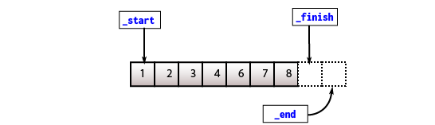
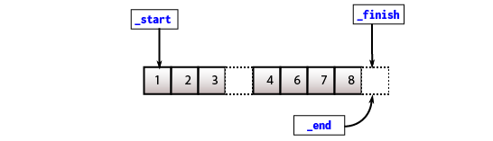
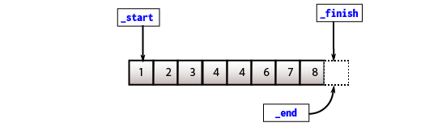

The _C++ Standard Template Library_ (or STL for short) has been around in the C++ comunnity for decades. It provides a set of C++ template classes and functions to support common data structures like `std::vector`.

# What is vector?

`std::vector` falls into the category [**Sequence Containers**](https://en.cppreference.com/w/cpp/container#Sequence_containers), which are containers that can be accessed sequentially. Like the good old C arrays, it allows users to perform pointer-like arithmetic calculation and random access. But now, it also has the abilility to resize itself automatically if needed as well as provides users a set of methods to manually grow or shrink the size by themself.

Another trait of a vector is that inserting an element to the back of the vector is constant time (_most of the time_). Removing the last element is also guaranteed to be constant time.

Finally, vectors will manage allocation and dellocation internally when it deals with creating, inserting, deleting or going out of scope. Users don't need to manage all of those painful tasks mannually.

# How is it managed?

Internally, `std::vector` is built on top of a C-style array. Everything, including data members and methods, is structured and operated around this one array.

With that being said, there are two major ways to maintain the necessary information about that array. Both are interchangeable, validated and accepted by many C++ programmers.

```cpp
// Approach 2
template <typename T>
class vector {
public:
    // public member functions
private:
    _Tp*          _data;      // Storage for all elements
    unsigned int  _capacity;  // Maximum elements can be stored
    unsigned int  _size;      // Current elements are stored
};

// Approach 2
template <typename T>
class vector {
public:
    // public member functions
private:
    _Tp*    _start;     // points to first element
    _Tp*    _end;       // points to one past internal storage
    _Tp*    _finish;    // points to one past last element
};
```

However, the C++ STL vector uses the second approach in the internal implementation. Thus, it will be the main approach in this artcile.

# How is it constructed?

To put it simply, the constructors (a special function to initialize vector objects) will examine the input arguments to get the number of elements. This will be the size of the new vector object. The vector then allocate an array according to the size, and construct elements to fill in the array. Finally, it will update the data members to maintain the array.

Take an example from the initializer-list constructor provided in `std::vector`:

```cpp
std::vector<int> v{ 1, 2, 3, 4, 5, 6, 7, 8 };
```

First, it will examine how many element there are in the initializer list, which is 8 in this case. This will determine how many space should be allocated for this new vector object. The size can be computed by many ways:

```cpp
// std::initialize_list<int> l = { 1, 2, 3, 4, 5, 6, 7, 8 };

std::size_t n1 = std::distance(l.begin(), l.end());
std::size_t n2 = l.size();
```

The allocator which is passed as a template argument by users takes the size and determine how many space to allocate for the internal array. This can be achieved through `allocator_traits::allocate()`. Then, it will iterate through the initializer list and construct elements with the same value. This is done by `allocator_traits::construct()`. Finally, it will update the three pointers to manage the internal array.

Here is the simplified version of initializer-list constructor of vector:

```cpp
constexpr vector(std::initializer_list<_Tp> init)
{
    using traits_t = std::allocator_traits<allocator>;

    const std::size_t n = init.size();
    this->_start      = traits_t::allocate(_alloc, n);
    this->_finish     = _start;
    for (auto curr = init.begin(); curr != init.end(); curr++)
    {
        traits_t::construct(_alloc, std::addressof(*_finish), *curr);
        _finish++;
    }
    _end = _start + n;
}
```

`std::vector` also has many other constructors to cover all possible use cases. See more [here](https://en.cppreference.com/w/cpp/container/vector/vector).

# What is iterator?

## Normal iterator

An _oversimplified_ explanation for iterators is a class wrapping around a pointer. The reason to create a class wrapping a pointer is to separate the operations carried by that iterator class because different containers require differences on how to work with those pointers underneath.

For example, `std::vector` is built on top of a C-style array internally. Elements can be accessed directly regardless how many elements are stored, or at constant time. This abilility is called [random access](https://en.wikipedia.org/wiki/Random_access).

Without too many details, a random access iterator will support overloaded operators to move the internal pointer foward or backward, one step or multiple steps at one time, to dereference and to access its data members if the type is a class.

In `std::vector`, `begin()` and `end()` are used to indicate the valid range of a vector object. `begin()` will return an iterator pointing to the first element while `end()` will return a iterator pointing to one past the last element.

<figure>
  
  <figcaption>
    Source:&nbsp;
    <a href="https://en.cppreference.com">https://en.cppreference.com</a>
  </figcaption>
</figure>

```cpp
std::vector<int> v{ 1, 2, 3, 4, 5, 6, 7, 8 };

auto prev = v.begin();

prev++;      // Move one step forward
prev--;      // Move one step backward
prev += 3;   // Move three steps forward
prev -= 3;   // Move three steps backward

auto curr = prev + 1;  // Move and assign
auto next = curr + 1;  // Move and assign

std::cout << *prev << " " << *curr<< " " << *next << "\n";
// Output: 1 2 3
```

## Const iterator

`std::vector` also introduces _const iterators_ via `cbegin()` and `cend()`. A constant iterator in `std::vector` is also a class wrapping around a pointer, but the pointer is a pointer to constant. A _pointer to constant_ allows to modify the pointer itself, but the pointed-to value should not be modified.

```cpp
std::vector<int> v{ 1, 2, 3, 4, 5, 6, 7, 8 };

auto curr  = v.begin();
auto ccurr = v.cbegin();

ccurr++;
ccurr--;
ccurr += 3;
ccurr -= 3;

*curr  = 3; // Change 1 to 3
*ccurr = 4; // This will result in compile error
```

## Reverse iterator

Like normal iterators, reverse iterators will go backward when using incremental operators and go forward when using decremental operators. Reverse iterators can be used by calling `rbegin()`, `rend()`, `crbegin()` and `crend()`.

Somewhat similar to normal iterator, `rbegin()` will point to the first element in the _reversed_ sequence and `rend()` will point to one-past the last element in the same _reversed_ seqquence.

<figure>
  
  <figcaption>
    Source:&nbsp;
    <a href="https://en.cppreference.com">https://en.cppreference.com</a>
  </figcaption>
</figure>

```cpp
std::vector<int> v{ 1, 2, 3, 4, 5, 6, 7, 8 };

std::cout << "Forward: { ";
std::for_each(v.begin(), v.end(), [](const auto& e) {
    std::cout << e << " ";
});
std::cout << " }\n";

std::cout << "Backward: { ";
std::for_each(v.rbegin(), v.rend(), [](const auto& e) {
    std::cout << e << " ";
});
std::cout << " }\n";

// Ouput:
// Forward: { 1, 2, 3, 4, 5, 6, 7, 8 }
// Backward: { 8, 7, 6, 5, 4, 3, 2, 1 }
```

# How does inserting work?

Unlike C-style arrays which are fixed after initialization, `std::vector` allows users to add as many elements as they want after initialization. It will handle the growing internally and automatically. But at this point, we all know that `std::vector` is built on top of a C-style array. So how does it work?

## Insert at the end

Let's discuss the simplest inserting operation in `std::vector`. Inserting at the end can be done easily by constructing a new object at the pointer `_end`. Simple, right? That's why vector is efficient for pushing new elements to the end because it guarantees that the time complexity is $O(1)$.

But you will hear many people say that the time complexity is _amortized constant_. The term _amortized time_ can be explained in simple terms.

Basically, adding new elements to the end of a vector takes a constant time regardless of the current size of the vector. But what happens when the array is full and there is no space to allocate and construct a new element?

Then the vector needs determine the new size (`std::vector` simply doubles the old size) and allocates a new array somewhere in memory according to the new size. Then it will move the data from the old array to the newly-allocated array and free the old array. Assume that allocating and dellocating the old array takes constant time (regardless what the old size is), moving each individual item from the old one to the new one takes $O(n)$ in time complexity where $n$ is the size of the old array.

But since this process happens once in while, its _"slowness"_ is diluted away when it's run, say, in a million times. It can be ignored when comparing to the average time taken to perform inserting.

> **TL;DR**
>
> 1. Check if there is an available space at the end. If yes, go to step 6.
> 2. If not, determine the new size (the old size is doubled mostly).
> 3. Allocate the new array according to the new size.
> 4. Move data from the old one to the new one.
> 5. Free up the space allocated to the old one.
> 6. Construct a new element at the end.
> 7. Update all the necessary data members.

## Insert anywhere

Now, inserting a new element anywhere in the vector is a bit more complicated. The data are stored a contiguous fashion so there is no available space to insert between elements. Therefore, making up space is required.

The process is called _shifting_. It will shift the data in the range `[pos, _finish)` to the right. Specifically, the data will be moved to the range `[pos + 1, _finish + 1)`. But first, it still needs to check if there is enough space to do so. It is done exactly as inserting at the end. After shifting, there will an available space at `pos` to construct a new element.

With the shifting process, inserting a new element anywhere takes $O(n)$ in time complexity where $n$ is the distance from `pos` to `_finish`. Therefore, the worst case is when inserting a new element at the front. That's why inserting at the front of a vector is not recommended due to its overhead.

For example, `insert(v.begin() + 3, 4)`:

<figure>
  
  
  
  <figcaption>
    A simple illustration how inserting an element anywhere works
  </figcaption>
</figure>
