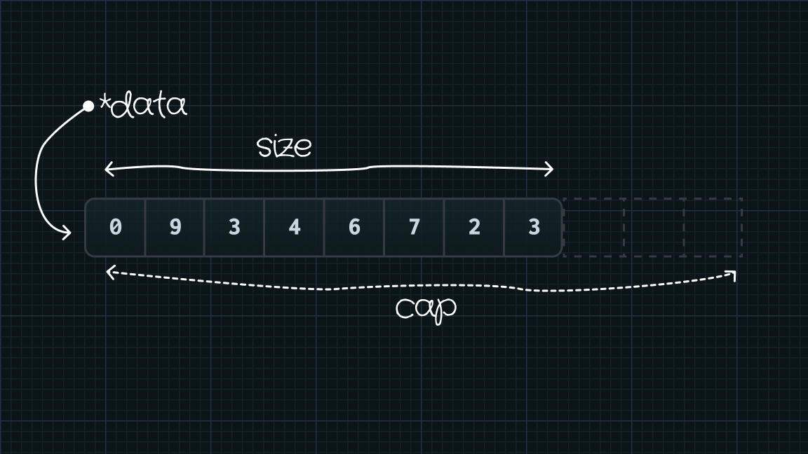
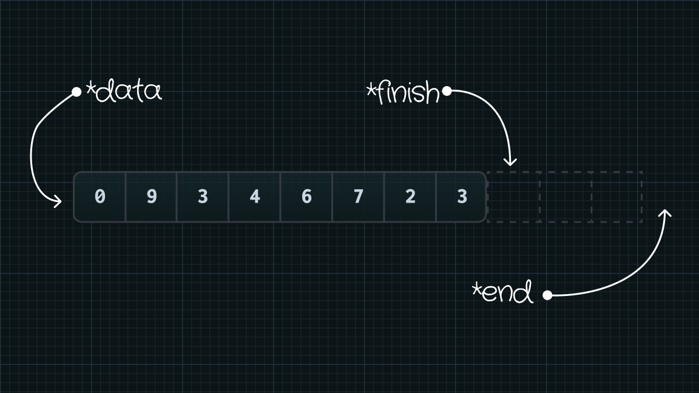
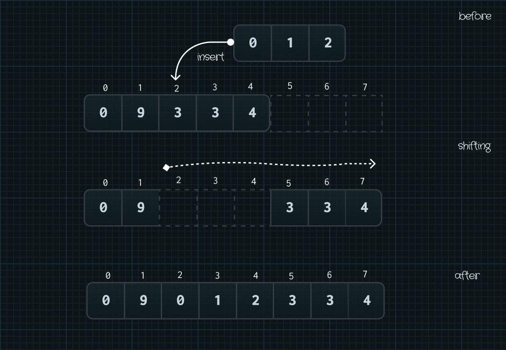
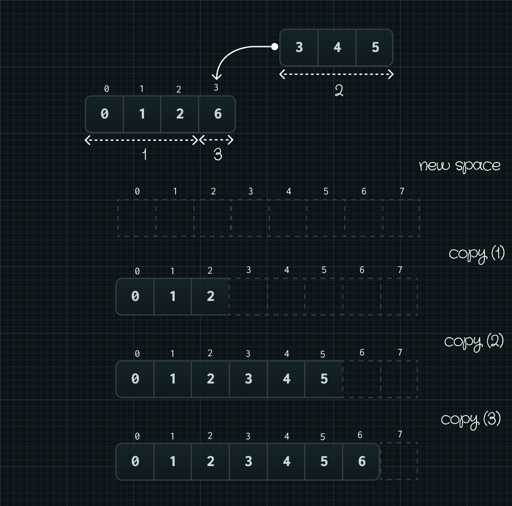

Have you heard the term _"dynamic array"_? As opposed to traditional arrays, whose size is fixed, dyanmic arrays can grow their size automatically when they need more space. You may have used [`java.util.ArrayList`](https://docs.oracle.com/javase/8/docs/api/java/util/ArrayList.html) in Java, or [`list`](https://docs.python.org/3/tutorial/datastructures.html) in Python. In C++, it has [`std::vector`](https://en.cppreference.com/w/cpp/container/vector). But have you wondered how these languages implemented this data structure? This article will answer that for you.

{/* Except */}

# Introduction

Vector is the [C++ Standard Template Library (STL)](https://cplusplus.com/reference/stl/) container that stores a collection of objects. Just like C-arrays, vector supports [Random (Direct) Access](https://en.wikipedia.org/wiki/Random_access) and pointer-arithmetic operations. Unlike C-arrays, vectors support many other functionalities to make your day easier:

- **Dynamic reallocation _(this is our focus)_**
- Templated
- Iterators
- Memory management
- Functions to add, remove, modify and retrieve information.

Our focus in this article is _dynamic reallocation_. Basically, when a vector is about to run out of space for new elements, it will allocate a new space with a sufficient size, then copy the old elements from the original space to the new one. But how does it work? What are the necessary _member fields_ to accomplish it? How does the _dynamic reallocation_ mechanism under the programming perspective?

> This article does not show the actual implementation of `std::vector`.
> The implementation is complex due to many support for different scenarios
> and use cases. My focus is more likely on the design and hopefully, you can
> come up with your own implementation from there.

# Member fields

As mentioned above, STD vector acts exactly like traditional C-arrays. So, using an array internally would be a good idea. As it turns out, STD vector actually uses an internal C-array to store data. The C-array is dynamically allocated on the heap, which can be done over `malloc()`, `operator new`, or [`std::allocator`](https://en.cppreference.com/w/cpp/memory/allocator).

Before revealing what the member fields look like, there are some concerns that we need to address due to dynamic memory allocation:

1. We want to know where **the allocated space starts and ends**. Missing them can lead to a memory leak.
2. We want to know **how many elements there are**. Missing it can cause a severe overflow.

Dynamically-allocated memory operations always a pointer pointing to the first block. So we already know where it starts. Then, how do we keep track of how many elements and where does this array end?

A straight-forward solution is to have two member fields to the keep track of them. Let's name them `size` for the number of elements, and `cap` for the capacity of this array. Then we can just do pointer-arithmetic operations to work with them

```cpp title="vector.h"

class vector
{
  public:
    ...
  private:
    int *data;
    int size;
    int cap;
};
```

<div className="mt-8">



</div>

Another way to do this is to use one pointer, `finish`, pointing to the next available space, and one pointer, `end`, pointing to pass-the-end of the array.

```cpp title=vector.h
class vector
{
  public:
    ...
  private:
    int *data;
    int *finish;
    int *end;
};
```

<div className="mt-8">



</div>

There are some confusions why `finish` does not point to the last element, but to one-past it. The reason is that when appending a new element to the vector, you can directly assignment value to the space pointed by this pointer, and increase the pointer. This will reduce the code complexity and minimize the pointer-arithmetic operations. Another reason is that if you want to get the size of vector, it can be done by subtracting two pointers, `finish - data`.

Both approaches are valid. However, STD vector prefers the second approach to the first one. Therefore, I will use the second approach for the rest of the article.

# How growing works

## Push back

Let's consider the most used method in STD vector, [`vector<T>::push_back`](https://cplusplus.com/reference/vector/vector/push_back/), which appends the new element to the back of the vector. The simple procedure to achieve this goal is described as below:

1. Check if there is enough space (i.e. `end - finish > 0`).
2. If there is enough space, go to step 6. Otherwise continue.
3. Allocate a new space with a new, sufficient capacity.
4. Copy the values from the old array to the new one.
5. Free the space of the old array.
6. Append the new element to end.

")

If our vector has enough space, the work to append a new element is simple; _just assign it the space pointed by `finish` and increment the pointer_. However, if there is not enough space, our vector has to find a new space. Allocation, copying and deallocation are expensive operations.

> In terms of time complexity, if there is enough space, the time complexity
> $O(1)$. Otherwise, the time complexity to copy all data is $O(N)$, with $N$
> is the number of elements. But since this happens once in a while,
> `push_back` is said to have an
> [amortized](https://en.wikipedia.org/wiki/Amortized_analysis) constant time.

To avoid allocating overhead, determining a new size is crucial. You can come up with crazy ideas to set a new size for your vector. However, a simple approach is to **double** the old size. In fact, this is how STD vector does it.

## Reserve space

At this point, we know that reallocation associated with vector is an expensive process, so we want to avoid it as much as possible. If we know how many elements we might need, we want to allocate that space beforehand.

STD C++ provides a method, called [`vector<T>::reserve()`](https://cplusplus.com/reference/vector/vector/reserve/) to achieve that goal. The method only increases the capacity when needed, and does not alternate the original elements.

```cpp title="main.cpp"
vector<int> foo(8);
auto print = [](const int& n) { std::cout << n << ' '; };

std::cout << "Old cap: " << foo.capacity() << "\n";

std::cout << "Data: [ "
std::for_each(foo.begin(), foo.end(), print)
std::cout << "]\n";

foo.reserve(100);
std::cout << "New cap: " << foo.capacity() << "\n";

std::cout << "Data: [ "
std::for_each(foo.begin(), foo.end(), print)
std::cout << "]\n";
```

```txt title="Output" showLineNumber=false enableCopy=false
Old cap: 8
Data: [ 0 0 0 0 0 0 0 0 ]
New cap: 100
Data: [ 0 0 0 0 0 0 0 0 ]
```

# Insert new elements

`push_back` is a great method, and it solves almost 95% use cases of vector. However, there are certain scenarios that you might need to insert elements at somewhere else except at the back. This is where you might need [`vector<T>::insert()`](https://cplusplus.com/reference/vector/vector/insert/).

## Without reallocation

Since all elements in a vector are stored contiguously, which means there is no
hole in a vector, inserting new elements at any random position requires some mechanisms to find space for new incoming elements.

That mechanism is called **shifting**. `insert()` will right-shift all the elements after the position to which you want to insert. After making some available space, you can now safely insert the new elements.



The shifting operation is the basis operation of this method, so the time complexity is linear depending the distance between your position to which you want to insert and the last element. In other words, inserting at the beginning of the vector is the worst case. Now, you get some ideas why vector is so great at inserting elements at the back but not at the front.

## With reallocation

The idea is pretty same as what we discussed in [How growing works](#how-growing-works). You need to find a space to store old and new elements. A simple approach can be as follow:

1. Allocate a new array
2. Copy the old array to the new one.
3. Perform shifting and insert the new elements.

This approach is straight-forward, but there is a way to combine copying and inserting. We can split the copying process into 3 parts. First part is the elements before the inserting position, the second part is the inserting elements and the last part is the remaining elements in the old array.

This will remove the overlap between copying and shifting from the "naive" approach, and yield a better performance. This illustration might help clear things out for you:


